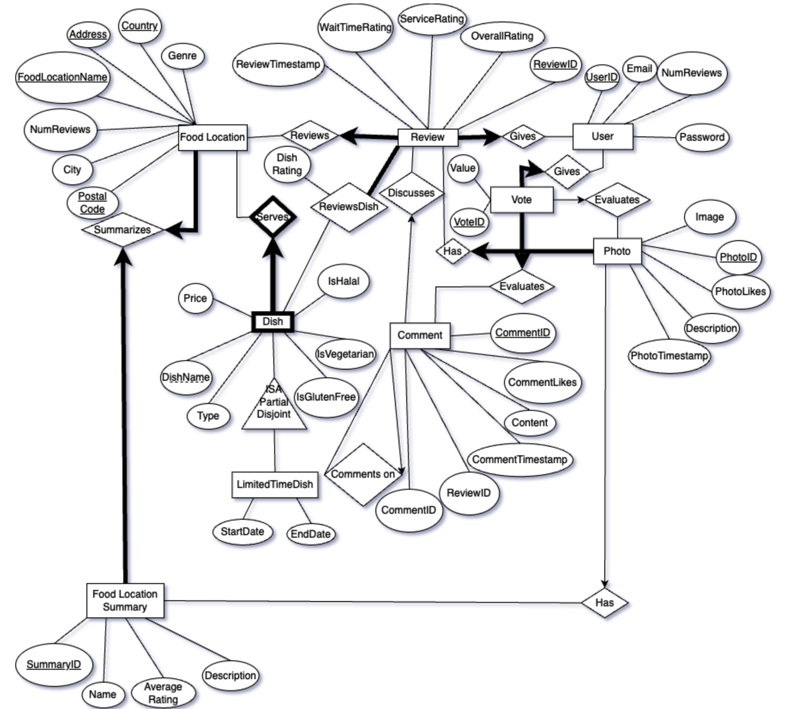

# Foodie app - Completed December 2024

I worked on this project with two peers as part of one of my university classes. 
To maximize our collaborative efficiency, we utilized Jira to assign tasks and deadlines.

'Foodie' is a specialized restaurant and cafe review platform that allows users to leave detailed reviews on individual dishes, service, wait times, and amenities, addressing the lack of dish-specific feedback on platforms like Tripadvisor or Yelp. 
Users can also browse nearby food locations, filtering by fields such as ratings, restaurant names and country. The application is built using React.js for the frontend and Express.js for the backend.

We additionally used an Oracle SQL database to store user data, the restaurants one can review, each restaurant's list of dishes, etc. The following image is an EER diagram that visualizes our data model.

Unfortunately, I no longer have access to the servers we used to host our database. This makes it difficult to provide a live demo of this app.
